# BÁO CÁO PHÂN TÍCH HÀNH VI DUYỆT WEB VÀ DỰ ĐOÁN KHẢ NĂNG TẠO DOANH THU

**Bộ dữ liệu:** `online_shoppers_intention.csv`  
**Quy mô dữ liệu:** 12.330 phiên truy cập, 18 biến  
**Biến mục tiêu:** `Revenue` - phiên truy cập có tạo doanh thu hay không  
**Nguồn phân tích:**  

- `web_browsing_behavior_analysis.ipynb`
- `web_browsing_time_analysis.ipynb`
- `revenue_prediction_model_comparison.ipynb`

**Ngày lập báo cáo:** 30/05/2026  

---

## Mục Lục

1. [Trang bìa](#báo-cáo-phân-tích-hành-vi-duyệt-web-và-dự-đoán-khả-năng-tạo-doanh-thu)
2. [Mục tiêu](#1-mục-tiêu)
3. [Câu hỏi nghiên cứu](#2-câu-hỏi-nghiên-cứu)
4. [Phương pháp](#3-phương-pháp)
5. [Phân tích hành vi duyệt web](#4-phân-tích-hành-vi-duyệt-web)
6. [Phân tích yếu tố thời gian](#5-phân-tích-yếu-tố-thời-gian)
7. [So sánh hiệu năng các thuật toán phân loại cơ bản](#6-so-sánh-hiệu-năng-các-thuật-toán-phân-loại-cơ-bản)
8. [Kết quả](#7-kết-quả)
9. [Đánh giá](#8-đánh-giá)
10. [Kết luận](#9-kết-luận)

---

## 1. Mục Tiêu

Báo cáo này tổng hợp các kết quả quan trọng từ ba notebook phân tích nhằm trả lời câu hỏi trung tâm: **những yếu tố nào liên quan đến khả năng một phiên truy cập website tạo ra doanh thu, và thuật toán phân loại cơ bản nào dự đoán kết quả này tốt nhất?**

Các mục tiêu cụ thể:

- Mô tả tổng quan dữ liệu và tỷ lệ chuyển đổi.
- Phân tích sự khác biệt về hành vi duyệt web giữa nhóm có mua hàng và không mua hàng.
- Đánh giá ảnh hưởng của các yếu tố thời gian như tháng truy cập, cuối tuần và mức độ gần ngày đặc biệt.
- So sánh một số thuật toán phân loại cơ bản để dự đoán `Revenue`.
- Rút ra insight có thể hỗ trợ báo cáo, tối ưu trải nghiệm người dùng và định hướng mô hình dự đoán.

---

## 2. Câu Hỏi Nghiên Cứu

Phân tích tập trung vào ba nhóm câu hỏi chính:

1. **Hành vi duyệt web:** Người dùng tạo doanh thu khác gì so với người dùng không tạo doanh thu về số trang đã xem, thời lượng truy cập, tỷ lệ thoát và giá trị trang?
2. **Yếu tố thời gian:** Tháng truy cập, cuối tuần và mức độ gần ngày đặc biệt có liên quan như thế nào đến tỷ lệ chuyển đổi?
3. **Mô hình dự đoán:** Trong các thuật toán phân loại cơ bản, mô hình nào dự đoán phiên truy cập có tạo doanh thu tốt nhất?

---

## 3. Phương Pháp

### 3.1. Dữ liệu và kiểm tra chất lượng

Dữ liệu gồm 12.330 phiên truy cập và 18 biến. Mỗi dòng tương ứng với một phiên duyệt web. Biến `Revenue` có kiểu boolean, trong đó `True` thể hiện phiên có tạo doanh thu và `False` thể hiện phiên không tạo doanh thu.

Kết quả kiểm tra dữ liệu:

| Hạng mục | Kết quả |
|---|---:|
| Số dòng | 12.330 |
| Số cột | 18 |
| Giá trị thiếu | 0 |
| Dòng trùng lặp | 125 |
| Tỷ lệ chuyển đổi chung | 15,47% |
| Phiên không tạo doanh thu | 10.422 |
| Phiên tạo doanh thu | 1.908 |

Tỷ lệ chuyển đổi chỉ khoảng 15,47%, cho thấy dữ liệu bị lệch lớp: số phiên không mua hàng lớn hơn nhiều so với số phiên mua hàng.

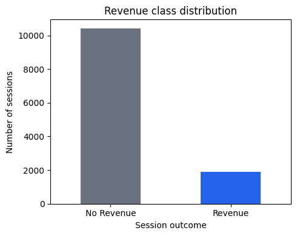

### 3.2. Kỹ thuật phân tích

Các kỹ thuật được sử dụng gồm:

- **Thống kê mô tả:** đếm số phiên, tính trung bình, trung vị và tỷ lệ chuyển đổi.
- **Feature engineering:** tạo thêm các biến tổng hợp như `TotalPages`, `TotalDuration`, `AvgDurationPerPage`, `ProductPageShare`.
- **Trực quan hóa:** dùng biểu đồ cột, histogram, biểu đồ đường và heatmap để quan sát pattern.
- **Tương quan:** xem mức độ liên hệ tuyến tính giữa các biến số và `Revenue`.
- **Kiểm định Chi-square và Cramer's V:** đánh giá mức độ liên hệ giữa các biến thời gian và `Revenue`.
- **Mô hình phân loại:** so sánh Logistic Regression, Decision Tree, Random Forest, KNN, Naive Bayes và SVM.

Với mô hình dự đoán, dữ liệu được chia thành tập train/test theo tỷ lệ 80/20 và có dùng `stratify` để giữ tỷ lệ `Revenue=True` tương tự giữa hai tập. Tập train có 9.864 dòng, tập test có 2.466 dòng.

---

## 4. Phân Tích Hành Vi Duyệt Web

### 4.1. Tạo biến hành vi tổng hợp

Từ các biến gốc về số trang và thời lượng theo nhóm trang, phân tích tạo thêm một số biến hành vi:

| Biến | Ý nghĩa |
|---|---|
| `TotalPages` | Tổng số trang đã xem trong phiên |
| `TotalDuration` | Tổng thời lượng duyệt web |
| `AvgDurationPerPage` | Thời lượng trung bình trên mỗi trang |
| `ProductPageShare` | Tỷ trọng trang sản phẩm trong toàn bộ phiên |
| `InfoAdminPageShare` | Tỷ trọng trang thông tin và hành chính |

Các biến này giúp mô tả mức độ tương tác tổng thể của người dùng thay vì chỉ nhìn từng nhóm trang riêng lẻ.

### 4.2. Khác biệt giữa phiên tạo doanh thu và không tạo doanh thu

Bảng dưới đây sử dụng trung vị để giảm ảnh hưởng của ngoại lệ, vì dữ liệu hành vi web thường lệch phải.

| Chỉ số | Không tạo doanh thu | Tạo doanh thu |
|---|---:|---:|
| `TotalPages` | 18,00 | 32,00 |
| `TotalDuration` | 588,17 | 1.252,08 |
| `AvgDurationPerPage` | 28,30 | 36,26 |
| `BounceRates` | 0,0043 | 0,0000 |
| `ExitRates` | 0,0286 | 0,0160 |
| `PageValues` | 0,00 | 16,76 |

Nhóm tạo doanh thu có xu hướng xem nhiều trang hơn, ở lại lâu hơn và có `PageValues` cao hơn rõ rệt. Ngược lại, `BounceRates` và `ExitRates` thấp hơn, cho thấy người dùng ít rời trang sớm hơn.

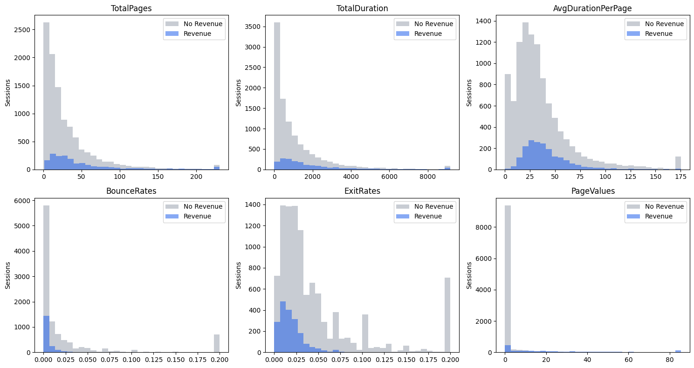

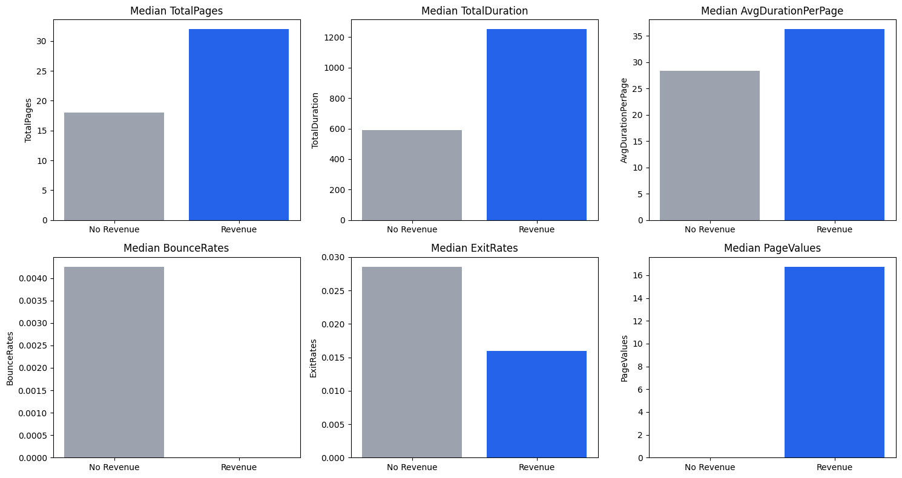

### 4.3. Các biến hành vi nổi bật

Khi so sánh trung bình giữa hai nhóm, `PageValues` là biến khác biệt mạnh nhất. Giá trị trung bình của `PageValues` ở nhóm tạo doanh thu là 27,26, trong khi nhóm không tạo doanh thu chỉ là 1,98, cao hơn khoảng 13,8 lần.

Một số biến có tương quan dương nổi bật với `Revenue`:

| Biến | Tương quan với `Revenue` |
|---|---:|
| `PageValues` | 0,4926 |
| `TotalPages` | 0,1641 |
| `ProductRelated` | 0,1585 |
| `TotalDuration` | 0,1561 |
| `ProductRelated_Duration` | 0,1524 |
| `Administrative` | 0,1389 |

Một số biến có tương quan âm đáng chú ý:

| Biến | Tương quan với `Revenue` |
|---|---:|
| `ExitRates` | -0,2071 |
| `BounceRates` | -0,1507 |
| `SpecialDay` | -0,0823 |
| `ProductPageShare` | -0,0470 |

Kết quả này phù hợp với trực giác: phiên có nhiều tương tác hơn thường có khả năng tạo doanh thu cao hơn, trong khi phiên có tỷ lệ thoát cao thường ít tạo doanh thu hơn.

### 4.4. Tỷ lệ chuyển đổi theo TrafficType

Biểu đồ dưới đây so sánh tỷ lệ chuyển đổi của 10 nhóm `TrafficType` có số phiên nhiều nhất.

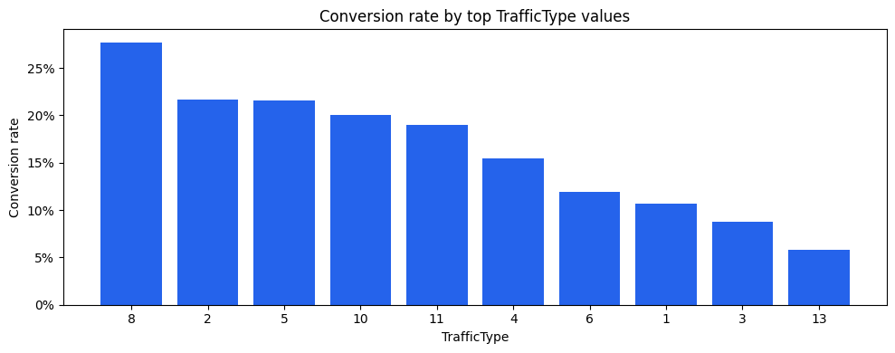

Trong các nhóm traffic phổ biến nhất, `TrafficType = 8` có tỷ lệ chuyển đổi cao nhất, khoảng 27,70%. Một số nhóm khác như `TrafficType = 2`, `5`, `10` và `11` cũng có tỷ lệ chuyển đổi tương đối tốt. Điều này cho thấy không phải nguồn traffic có nhiều phiên nhất luôn là nguồn hiệu quả nhất; cần đánh giá đồng thời cả quy mô phiên và tỷ lệ chuyển đổi.

---

## 5. Phân Tích Yếu Tố Thời Gian

### 5.1. Tỷ lệ chuyển đổi theo tháng

Tỷ lệ chuyển đổi thay đổi rõ theo tháng. Tháng 11 có tỷ lệ chuyển đổi cao nhất, đạt 25,35%, tiếp theo là tháng 10 với 20,95% và tháng 9 với 19,20%.

| Tháng | Số phiên | Phiên chuyển đổi | Tỷ lệ chuyển đổi |
|---|---:|---:|---:|
| Nov | 2.998 | 760 | 25,35% |
| Oct | 549 | 115 | 20,95% |
| Sep | 448 | 86 | 19,20% |
| Aug | 433 | 76 | 17,55% |
| Jul | 432 | 66 | 15,28% |
| Dec | 1.727 | 216 | 12,51% |
| May | 3.364 | 365 | 10,85% |
| June | 288 | 29 | 10,07% |
| Mar | 1.907 | 192 | 10,07% |
| Feb | 184 | 3 | 1,63% |

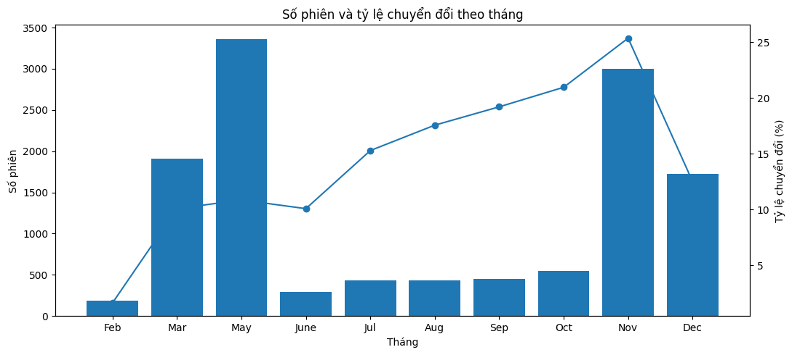

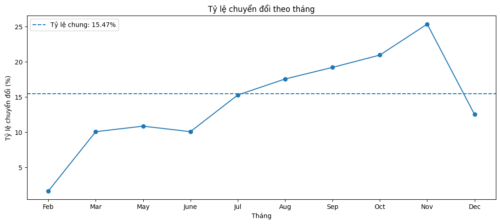

Tháng 5 có số phiên lớn nhất nhưng tỷ lệ chuyển đổi chỉ 10,85%, thấp hơn mức trung bình chung. Ngược lại, tháng 11 vừa có lượng phiên lớn vừa có tỷ lệ chuyển đổi cao, nên đây là giai đoạn có hiệu quả kinh doanh nổi bật nhất trong dữ liệu.

### 5.2. Tỷ lệ chuyển đổi theo cuối tuần

| Nhóm ngày | Số phiên | Phiên chuyển đổi | Tỷ lệ chuyển đổi |
|---|---:|---:|---:|
| Ngày thường | 9.462 | 1.409 | 14,89% |
| Cuối tuần | 2.868 | 499 | 17,40% |

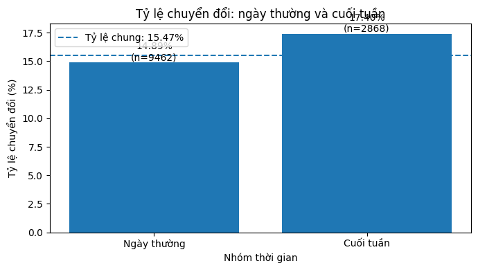

Phiên truy cập vào cuối tuần có tỷ lệ chuyển đổi cao hơn ngày thường khoảng 2,51 điểm phần trăm. Tuy nhiên, chênh lệch này không quá lớn; yếu tố cuối tuần có tác động yếu hơn so với yếu tố tháng.

### 5.3. Tỷ lệ chuyển đổi theo SpecialDay

`SpecialDay` thể hiện mức độ gần với ngày đặc biệt. Trong dữ liệu này, nhóm `SpecialDay = 0` có tỷ lệ chuyển đổi cao nhất, đạt 16,53%. Các nhóm có `SpecialDay > 0` đều có tỷ lệ chuyển đổi thấp hơn.

| `SpecialDay` | Số phiên | Phiên chuyển đổi | Tỷ lệ chuyển đổi |
|---:|---:|---:|---:|
| 0,0 | 11.079 | 1.831 | 16,53% |
| 0,2 | 178 | 14 | 7,87% |
| 0,4 | 243 | 13 | 5,35% |
| 0,6 | 351 | 29 | 8,26% |
| 0,8 | 325 | 11 | 3,38% |
| 1,0 | 154 | 10 | 6,49% |

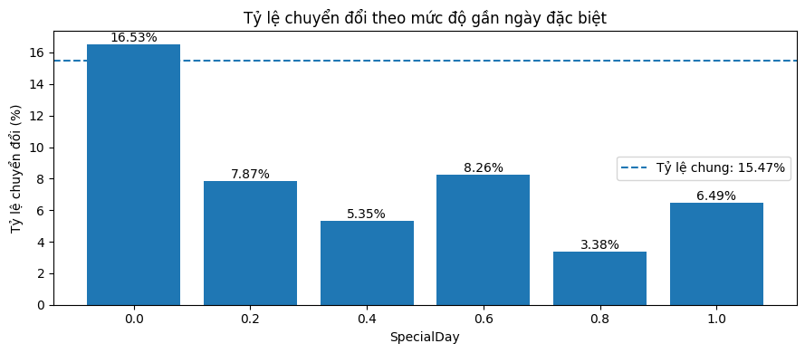

Kết quả này gợi ý rằng trong bộ dữ liệu hiện tại, các phiên gần ngày đặc biệt không nhất thiết có tỷ lệ mua hàng cao hơn. Có thể người dùng khảo sát hoặc so sánh sản phẩm trước ngày đặc biệt nhưng chưa mua ngay trong phiên.

### 5.4. Kết hợp tháng và cuối tuần

Heatmap dưới đây cho thấy tỷ lệ chuyển đổi khi xét đồng thời `Month` và `Weekend`.

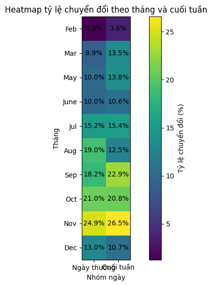

Một số tháng có tỷ lệ chuyển đổi cuối tuần cao hơn ngày thường, ví dụ tháng 9 và tháng 11. Tuy nhiên, hiệu ứng cuối tuần không đồng nhất ở mọi tháng; tháng 8 và tháng 12 lại có tỷ lệ chuyển đổi cuối tuần thấp hơn ngày thường.

### 5.5. Kiểm định liên hệ giữa biến thời gian và Revenue

Cramer's V được dùng để đánh giá mức độ liên hệ giữa biến thời gian dạng phân loại và `Revenue`.

| Biến thời gian | Chi-square | Cramer's V | Diễn giải |
|---|---:|---:|---|
| `Month` | 384,9348 | 0,1767 | Liên hệ rõ nhất trong ba biến |
| `SpecialDay` | 96,0769 | 0,0883 | Liên hệ yếu |
| `Weekend` | 10,5818 | 0,0293 | Liên hệ rất yếu |

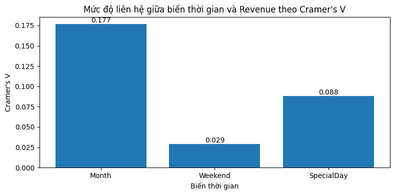

Kết quả cho thấy `Month` là biến thời gian có liên hệ rõ nhất với tỷ lệ chuyển đổi. `Weekend` tuy có chênh lệch tỷ lệ chuyển đổi, nhưng mức độ liên hệ tổng thể khá yếu.

---

## 6. So Sánh Hiệu Năng Các Thuật Toán Phân Loại Cơ Bản

### 6.1. Thiết lập mô hình

Các mô hình được so sánh:

- Logistic Regression
- Decision Tree
- Random Forest
- KNN
- Naive Bayes
- SVM

Các biến phân loại như `Month`, `OperatingSystems`, `Browser`, `Region`, `TrafficType`, `VisitorType`, `Weekend` được mã hóa bằng One-Hot Encoding. Các biến số được chuẩn hóa bằng `StandardScaler`. Toàn bộ tiền xử lý được đặt trong `Pipeline` để tránh rò rỉ dữ liệu giữa tập train và test.

Do dữ liệu bị lệch lớp, việc đánh giá không chỉ dựa vào `accuracy`. Báo cáo ưu tiên thêm các chỉ số `precision`, `recall`, `F1-score` và `ROC-AUC`.

### 6.2. Kết quả so sánh mô hình

| Mô hình | Accuracy | Precision | Recall | F1-score | ROC-AUC | TP | FP | FN | TN |
|---|---:|---:|---:|---:|---:|---:|---:|---:|---:|
| SVM | 0,8654 | 0,5477 | 0,7513 | 0,6336 | 0,8979 | 287 | 237 | 95 | 1.847 |
| Decision Tree | 0,8297 | 0,4714 | 0,8194 | 0,5985 | 0,8859 | 313 | 351 | 69 | 1.733 |
| Logistic Regression | 0,8410 | 0,4913 | 0,7435 | 0,5917 | 0,8932 | 284 | 294 | 98 | 1.790 |
| Random Forest | 0,8970 | 0,7667 | 0,4817 | 0,5916 | 0,9208 | 184 | 56 | 198 | 2.028 |
| KNN | 0,8731 | 0,7143 | 0,3010 | 0,4236 | 0,8266 | 115 | 46 | 267 | 2.038 |
| Naive Bayes | 0,2729 | 0,1726 | 0,9738 | 0,2933 | 0,7334 | 372 | 1.783 | 10 | 301 |

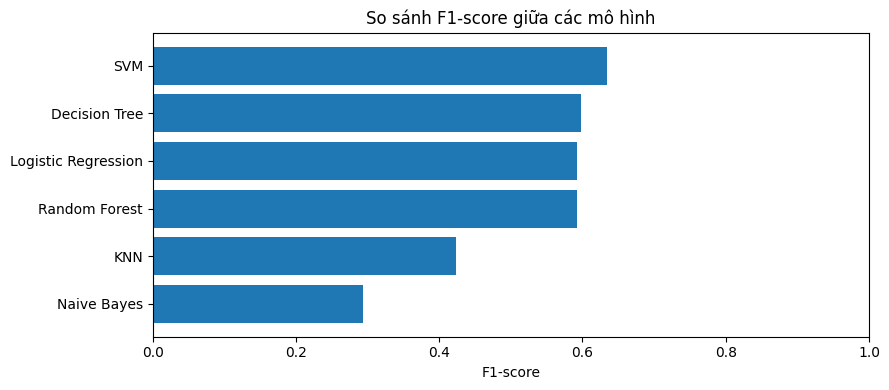

### 6.3. Nhận xét mô hình

Nếu ưu tiên **F1-score**, mô hình tốt nhất là **SVM** với F1-score đạt 0,6336. SVM cân bằng tương đối tốt giữa precision và recall, tức vừa tìm được nhiều phiên có khả năng mua, vừa không tạo quá nhiều dự đoán dương sai.

Nếu ưu tiên **ROC-AUC** hoặc **accuracy**, **Random Forest** nổi bật hơn với accuracy 0,8970 và ROC-AUC 0,9208. Tuy nhiên, recall của Random Forest chỉ đạt 0,4817, nghĩa là mô hình bỏ sót khá nhiều phiên thực sự có mua.

Decision Tree có recall cao nhất trong các mô hình thực dụng hơn, đạt 0,8194, nhưng precision chỉ 0,4714. Điều này phù hợp nếu mục tiêu là không bỏ sót khách hàng tiềm năng, nhưng sẽ phải chấp nhận nhiều cảnh báo giả hơn.

---

## 7. Kết Quả

Các kết quả chính có thể tổng hợp như sau:

1. **Tỷ lệ chuyển đổi chung thấp:** chỉ 15,47% phiên truy cập tạo doanh thu, cho thấy bài toán bị lệch lớp.
2. **Hành vi tương tác là tín hiệu quan trọng:** phiên tạo doanh thu có `TotalPages`, `TotalDuration`, `AvgDurationPerPage` và `PageValues` cao hơn rõ rệt.
3. **`PageValues` là biến nổi bật nhất:** tương quan với `Revenue` đạt 0,4926 và giá trị trung bình ở nhóm mua hàng cao hơn khoảng 13,8 lần so với nhóm không mua.
4. **Tỷ lệ thoát có quan hệ ngược chiều với chuyển đổi:** `ExitRates` và `BounceRates` đều có tương quan âm với `Revenue`.
5. **Thời gian truy cập có vai trò đáng kể:** tháng 11 là tháng có tỷ lệ chuyển đổi cao nhất, đạt 25,35%.
6. **Cuối tuần có tỷ lệ chuyển đổi cao hơn ngày thường**, nhưng mức độ liên hệ tổng thể yếu hơn nhiều so với tháng.
7. **`TrafficType = 8` là nhóm traffic hiệu quả nhất trong nhóm có ít nhất 50 phiên**, với tỷ lệ chuyển đổi khoảng 27,70%.
8. **SVM là mô hình tốt nhất theo F1-score**, trong khi Random Forest tốt nhất theo accuracy và ROC-AUC.

---

## 8. Đánh Giá

### 8.1. Điểm mạnh của phân tích

- Kết hợp cả phân tích mô tả, trực quan hóa và mô hình dự đoán.
- Tách riêng phân tích hành vi và phân tích thời gian, giúp insight rõ ràng hơn.
- Dùng trung vị bên cạnh trung bình để giảm ảnh hưởng của ngoại lệ.
- Khi so sánh mô hình, không chỉ dùng accuracy mà còn xem precision, recall, F1-score và ROC-AUC.
- Quy trình modeling sử dụng `Pipeline`, giúp hạn chế rò rỉ dữ liệu khi tiền xử lý.

### 8.2. Hạn chế

- Phân tích EDA chỉ cho thấy mối liên hệ, không chứng minh quan hệ nhân quả.
- Dữ liệu có 125 dòng trùng lặp; tỷ lệ nhỏ nhưng vẫn nên xử lý rõ ràng hơn nếu đưa vào mô hình cuối cùng.
- `PageValues` có thể là biến rất gần với kết quả mua hàng, cần cân nhắc kỹ nếu mục tiêu là dự đoán sớm trước khi phiên kết thúc.
- Chưa tối ưu siêu tham số chuyên sâu cho từng mô hình.
- Chưa đánh giá mô hình bằng cross-validation hoặc tập dữ liệu ngoài.

### 8.3. Hàm ý thực tế

- Nên theo dõi kỹ các phiên có nhiều tương tác với trang sản phẩm, tổng thời lượng cao và `PageValues` cao.
- Các nguồn traffic có tỷ lệ chuyển đổi cao nên được ưu tiên phân tích sâu hơn về chi phí và chất lượng.
- Tháng 9-11 là giai đoạn có tỷ lệ chuyển đổi tốt, đặc biệt tháng 11; có thể là thời điểm phù hợp cho chiến dịch marketing.
- Nếu dùng mô hình để hỗ trợ remarketing, SVM là lựa chọn cân bằng theo F1-score; nếu cần xếp hạng xác suất khách hàng, Random Forest đáng cân nhắc nhờ ROC-AUC cao.

---

## 9. Kết Luận

Phân tích cho thấy khả năng tạo doanh thu của một phiên truy cập liên quan mạnh đến mức độ tương tác của người dùng. Các phiên mua hàng thường xem nhiều trang hơn, ở lại lâu hơn, có `PageValues` cao hơn và có tỷ lệ thoát thấp hơn. Trong các biến hành vi, `PageValues` là tín hiệu nổi bật nhất.

Về yếu tố thời gian, `Month` có liên hệ rõ nhất với tỷ lệ chuyển đổi. Tháng 11 là tháng nổi bật nhất, vừa có số phiên lớn vừa có tỷ lệ chuyển đổi cao. `Weekend` có tỷ lệ chuyển đổi cao hơn ngày thường, nhưng mức độ liên hệ tổng thể yếu.

Về mô hình dự đoán, **SVM** là mô hình phù hợp nhất nếu chọn theo F1-score, do cân bằng tốt giữa precision và recall trong bối cảnh dữ liệu lệch lớp. **Random Forest** có accuracy và ROC-AUC cao nhất, nhưng recall thấp hơn, nên phù hợp hơn nếu mục tiêu là xếp hạng xác suất thay vì phát hiện tối đa phiên có mua.

Nhìn chung, bộ phân tích này cung cấp nền tảng tốt để hiểu hành vi người dùng, xác định các yếu tố liên quan đến chuyển đổi và xây dựng mô hình dự đoán ở các bước tiếp theo.
